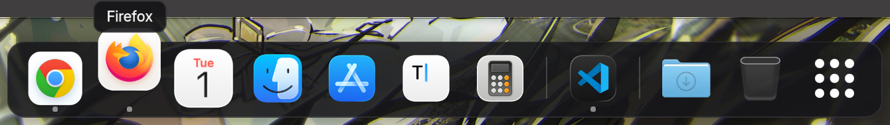
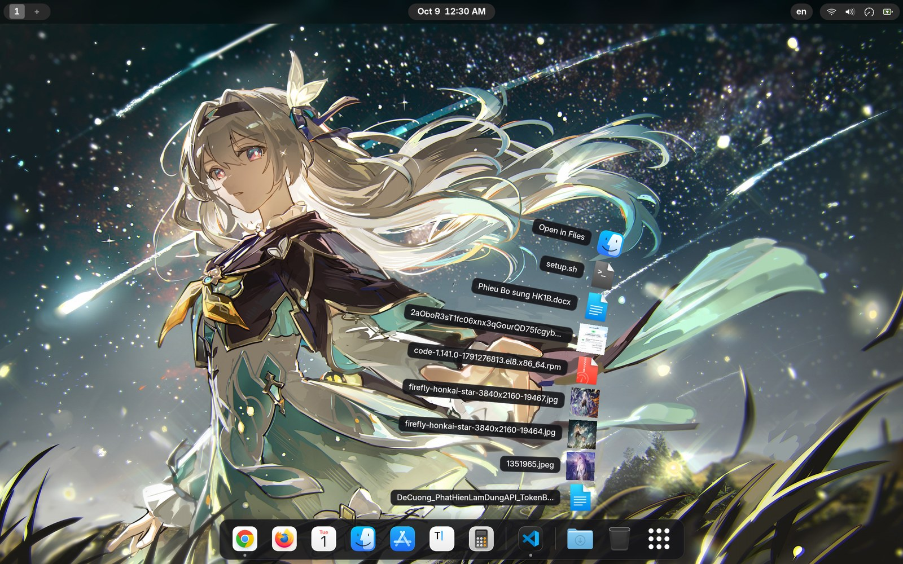

# GlideDock

A featherweight dock for GNOME Shell with smooth magnification and a jitter-free app label.


GlideDock shows your pinned and running apps in a small bar at the edge of the
screen. Icons are rendered once at their magnified size and only ever scaled at
paint time, so hovering the dock never triggers a relayout: the bar, the icons
next to the pointer and the label above them stay exactly where they are.





## Features

- **Smooth magnification** – icons near the pointer rise and sink like a wave, updated once per frame.
- **Jitter-free label** – a single tooltip placed on whole pixels at a fixed distance from the icon; it does not follow the animation.
- **Same dock on the desktop and in the overview** – GlideDock can take the place of the built-in dash, so nothing changes when the overview opens.
- **One Show Apps icon everywhere** – the dock and the shell's own dash share one flat symbolic icon that shell themes (WhiteSur, MacTahoe, …) cannot replace with a coloured one.
- **Trash and Downloads** – macOS-style items at the end of the dock: the trash shows whether it holds anything and can be emptied from its menu, the downloads folder lists the files changed last.
- **Stacks** – click the downloads folder and its latest files fan out of the icon; click one to open it.
- **Launch bounce** – the icon of an app that is starting bounces until its window appears.
- **Intellihide** – the dock slides away while a window overlaps it and comes back when the pointer touches the screen edge.
- **Bottom, left or right**, aligned to the start, centre or end of the edge.
- **Pinned and running apps** with an optional separator and running indicators; icons never change places on their own.
- **Mouse actions** – click the focused app to cycle or minimize its windows, scroll over an icon to step through them.
- **Blurred background** (optional), adjustable opacity, corner radius, spacing and padding.
- **Translatable** – ships with English and Vietnamese.

## Requirements

- GNOME Shell 45, 46, 47, 48, 49 or 50
- To build: `gnome-extensions`, `glib-compile-schemas`, `gjs`, `msgfmt`, `zip`, `unzip` and `python3`

```bash
# Fedora
sudo dnf install gnome-shell glib2 gjs gettext zip unzip python3

# Debian / Ubuntu
sudo apt install gnome-shell libglib2.0-bin gjs gettext zip unzip python3
```

## Installation

```bash
git clone https://github.com/bquangthien25-hub/GlideDock.git
cd GlideDock
./build.sh --install
```

`build.sh` checks the sources, compiles the settings schema, packs
`glidedock@bquangthien25.github.io.zip` and, with `--install`, installs it for
the current user.

Then load the new code and turn the extension on:

1. Log out and back in (on X11, `Alt`+`F2`, `r`, `Enter` is enough).
2. Enable the extension:

   ```bash
   gnome-extensions enable glidedock@bquangthien25.github.io
   ```

To remove it again:

```bash
gnome-extensions uninstall glidedock@bquangthien25.github.io
```

## Configuration

Open the preferences from the Extensions app, or run:

```bash
gnome-extensions prefs glidedock@bquangthien25.github.io
```

| Page | Setting | Default | Notes |
| --- | --- | --- | --- |
| Position & Size | Position on screen | Bottom | Bottom, left or right |
| | Alignment | Center | Start, center or end of the edge |
| | Show in the overview | On | Replaces the built-in dash |
| | Icon size | 48 px | 24–96 |
| | Icon spacing | 2 px | 2–16 |
| | Dock padding | 8 px | 0–24 |
| Launchers | Show Apps button | On | At the start or at the end (default) |
| | Separator | On | Between pinned and other running apps |
| | Running indicators | On | A dot under running apps |
| | Order of running apps | Order started | Or by name |
| | Show Trash | On | Click to open, right-click to empty |
| | Show Downloads Folder | On | Click to open, right-click for recent files |
| | Stacks Fan View | On | Click the downloads folder to fan out its latest files |
| | Separate special items with divider | On | A line between the apps and these items |
| Behavior | Intellihide | Off | Hide while a window overlaps the dock |
| | Hide delay / Show delay | 300 ms / 100 ms | 0–2000 |
| | Click on the focused app | Cycle through windows | Minimize, minimize-or-cycle, or nothing |
| | Scroll to switch windows | On | |
| Appearance | Magnify on hover | On | |
| | Maximum scale | 1.35 | 1.0–2.0 |
| | Background opacity | 0.85 | 0–1 |
| | Corner radius | 16 px | 0–40 |
| | Blur background | Off | Strength 30, brightness 0.6 |

Every setting is also available from the command line. Until the extension is
installed system-wide, point `gsettings` at its schema directory:

```bash
gsettings --schemadir ~/.local/share/gnome-shell/extensions/glidedock@bquangthien25.github.io/schemas \
    set org.gnome.shell.extensions.glidedock position 'left'
```

## Development

```bash
./build.sh                      # lint, compile schemas and pack the zip
./build.sh --install            # ...and install it for the current user
./tools/update-translations.sh  # refresh po/glidedock.pot and po/*.po
```

| Path | Contents |
| --- | --- |
| `extension.js` | Entry point; creates and destroys the dock |
| `lib/dock.js` | Actors, placement, auto-hide and overview handling |
| `lib/magnifier.js` | Per-frame icon scaling around the pointer |
| `lib/showAppsIcon.js` | The Show Apps icon shared with the shell's dash |
| `lib/appModel.js`, `lib/appActions.js` | Which apps are shown, and what clicking them does |
| `lib/places.js` | The trash and the downloads folder |
| `lib/stacks.js`, `lib/bounce.js` | The fan of a stack, and the bounce of a launching app |
| `lib/blur.js`, `lib/overlap.js` | Background blur and window overlap tracking |
| `prefs.js`, `schemas/` | Preferences window and settings schema |
| `po/` | Translations |

To translate GlideDock, copy `po/glidedock.pot` to `po/<language>.po`,
translate it and open a pull request.

Bug reports and pull requests are welcome at
<https://github.com/bquangthien25-hub/GlideDock/issues>. Please include your
GNOME Shell version and the output of
`journalctl --user -b -g glidedock` when reporting a problem.

## License

GlideDock is free software, distributed under the terms of the
[GNU General Public License, version 2 or later](LICENSE).
